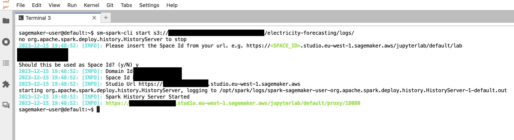
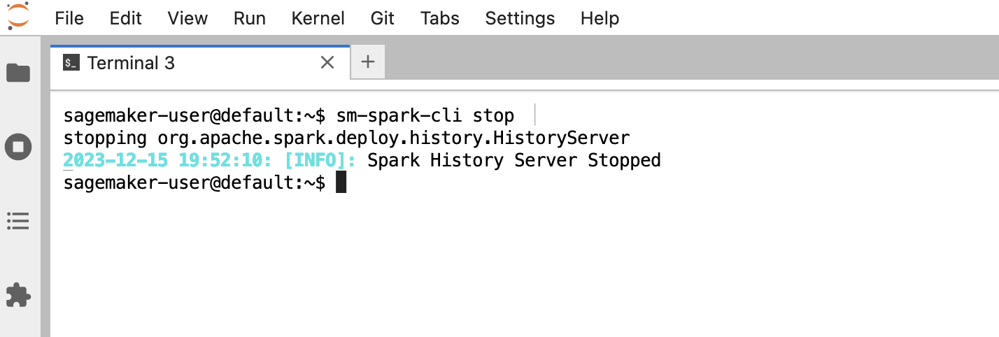

# Hosting Spark History Server on Amazon SageMaker Studio

A solution to install and run Spark History Server on Amazon SageMaker Studio and access the Spark UI.


## Highlights

This solution works for:
* Amazon SageMaker Studio
    * JupyterLab Application
* Amazon SageMaker Studio Classic
    * JupyterLab 3 (recommended)
    * JupyterLab 1

The solution works for Spark versions **3.1.1**, **3.1.3**, and **3.3.1**.

## Features - Amazon SageMaker Studio

* Access Spark History Server from Amazon SageMaker Studio IDE
* Explore logs generated by Spark Jobs stored in Amazon S3
* Compatible with logs generated by third party Spark application
* Utility CLI for managing Spark History Server daemon on the Studio Jupyter Server
* This solution use an updated version of the files org/apache/spark/ui/static/utils.js and org/apache/spark/ui/static/stagepage.js, for solving a known bug on the Spark implementation related to the proxy

## Screenshots

### SageMaker Studio

#### JupyterLab Application

<table style="{border: none; text-align: center;}" width="70%">
    <tr>
        <td></td>
        <td></td>
    </tr>
</table>

### SageMaker Studio Classic

<table style="{border: none; text-align: center;}" width="70%">
    <tr>
        <td colspan="2"></td>
    </tr>
    <tr>
        <td></td>
        <td></td>
    </tr>
</table>

---

<table style="{border: none; text-align: center;}" width="70%">
    <tr>
        <td></td>
    </tr>
</table>

## Getting started
There are two ways to get started and install the solution:

- [Recommended] Using lifecycle configuration scripts that will install Spark History Server automatically when SageMaker Studio is spin-up.
- Install Spark History Server manually from the Jupyter system terminal

In both cases we are going to leverage on the following install scripts:

* SageMaker Studio: *install-history-server* and utility CLI *sm-spark-cli* 

### Install with Lifecycle Configurations

#### Amazon SageMaker Studio: JupyterLab Application

When using Amazon SageMaker Studio with JupyterLab Applications, Spark History Server will be installed on the instance that runs the the application. By using [Studio lifecycle configurations](https://docs.aws.amazon.com/sagemaker/latest/dg/studio-lcc.html), we can make sure Spark History Server is installed automatically when the application is spin-up, and enable this behavior by default either for all users in the Studio domain or for a specific Studio user profile.

Example: install Spark History Server automatically for all users in the Studio domain

From a terminal appropriately configured with AWS CLI, run the following commands:

```
curl -LO https://github.com/aws-samples/amazon-sagemaker-spark-ui/releases/download/v0.6.0/amazon-sagemaker-spark-ui.tar.gz

tar -xvzf amazon-sagemaker-spark-ui.tar.gz

cd amazon-sagemaker-spark-ui/install-scripts/studio

LCC_CONTENT=`openssl base64 -A -in install-history-server.sh`

aws sagemaker create-studio-lifecycle-config \
    --studio-lifecycle-config-name install-spark-ui-on-jupyterlab \
    --studio-lifecycle-config-content $LCC_CONTENT \
    --studio-lifecycle-config-app-type JupyterLab \
    --query 'StudioLifecycleConfigArn'

aws sagemaker update-domain \
    --region <your_region> \
    --domain-id <your_domain_id> \
    --default-user-settings \
    '{
    "JupyterLabAppSettings": {
    "DefaultResourceSpec": {
    "LifecycleConfigArn": "arn:aws:sagemaker:<your_region>:<your_account_id>:studio-lifecycle-config/install-spark-ui-on-jupyterlab",
    "InstanceType": "ml.t3.medium"
    },
    "LifecycleConfigArns": [
    "arn:aws:sagemaker:<your_region>:<your_account_id>:studio-lifecycle-config/install-spark-ui-on-jupyterlab"
    ]
    }}'
```

Make sure to replace <your_domain_id>, <your_region> and <your_account_id> in the previous commands with the Studio domain ID, the AWS region and AWS Account ID you are using respectively.

#### Amazon SageMaker Studio Classic

When using Amazon SageMaker Studio, Spark History Server must be installed on the instance that runs the JupyterServer application. For further information on the Studio architecture, please refer to [this](https://aws.amazon.com/blogs/machine-learning/dive-deep-into-amazon-sagemaker-studio-notebook-architecture/) blog post. By using [Studio lifecycle configurations](https://docs.aws.amazon.com/sagemaker/latest/dg/studio-lcc.html), we can make sure Spark History Server is installed automatically when the JupyterServer application is spin-up, and enable this behavior by default either for all users in the Studio domain or for a specific Studio user profile.

Example: install Spark History Server automatically for all users in the Studio domain

From a terminal appropriately configured with AWS CLI, run the following commands:

```
curl -LO https://github.com/aws-samples/amazon-sagemaker-spark-ui/releases/download/v0.6.0/amazon-sagemaker-spark-ui.tar.gz

tar -xvzf amazon-sagemaker-spark-ui.tar.gz

cd amazon-sagemaker-spark-ui/install-scripts/studio-classic

LCC_CONTENT=`openssl base64 -A -in install-history-server.sh`

aws sagemaker create-studio-lifecycle-config \
    --studio-lifecycle-config-name install-spark-ui-on-jupyterserver \
    --studio-lifecycle-config-content $LCC_CONTENT \
    --studio-lifecycle-config-app-type JupyterServer \
    --query 'StudioLifecycleConfigArn'

aws sagemaker update-domain \
    --region <your_region> \
    --domain-id <your_domain_id> \
    --default-user-settings \
    '{
    "JupyterServerAppSettings": {
    "DefaultResourceSpec": {
    "LifecycleConfigArn": "arn:aws:sagemaker:<your_region>:<your_account_id>:studio-lifecycle-config/install-spark-ui-on-jupyterserver",
    "InstanceType": "system"
    },
    "LifecycleConfigArns": [
    "arn:aws:sagemaker:<your_region>:<your_account_id>:studio-lifecycle-config/install-spark-ui-on-jupyterserver"
    ]
    }}'
```

Make sure to replace <your_domain_id>, <your_region> and <your_account_id> in the previous commands with the Studio domain ID, the AWS region and AWS Account ID you are using respectively.

### Install manually

#### Amazon SageMaker Studio

Amazon SageMaker Studio

1. Open the Amazon SageMaker Studio system terminal
2. From the terminal, run the following commands:

```
curl -LO https://github.com/aws-samples/amazon-sagemaker-spark-ui/releases/download/v0.6.0/amazon-sagemaker-spark-ui.tar.gz

tar -xvzf amazon-sagemaker-spark-ui.tar.gz

cd amazon-sagemaker-spark-ui/install-scripts/studio

chmod +x install-history-server.sh
./install-history-server.sh
```

#### Amazon SageMaker Studio Classic

Amazon SageMaker Studio

1. Open the Amazon SageMaker Studio system terminal
2. From the terminal, run the following commands:

```
curl -LO https://github.com/aws-samples/amazon-sagemaker-spark-ui/releases/download/v0.6.0/amazon-sagemaker-spark-ui.tar.gz

tar -xvzf amazon-sagemaker-spark-ui.tar.gz

cd amazon-sagemaker-spark-ui/install-scripts/studio-classic

chmod +x install-history-server.sh
./install-history-server.sh
```
## sm-spark-cli

We can manage Spark History Server in Amazon SageMaker Studio by using the provided CLI *sm-spark-cli*, a program we can use at a command line level. We can access the utilities provided from the System Terminal in the SageMaker Studio Jupyter Server App.

### Help

```
sm-spark-cli

SM Spark CLI
Usage: sm-spark-cli [command]
Commands:
  start [a-z][a-z0-9.-]{1,61}[a-z]$   Start Spark History Server
  stop                                Stop Spark History Server
  status                              Spark History Server Status
  *                                   Help
```

### Start Spark History Server

```
sm-spark-cli start <S3_LOGS_PATH>
```

Example:

```
sm-spark-cli start s3://DOC-EXAMPLE-BUCKET/<SPARK_EVENT_LOGS_LOCATION>
```

### Stop Spark History Server

```
sm-spark-cli stop
```

### Spark History Server Status

Check if Spark History Server is running in SageMaker Studio

```
sm-spark-cli status

2023-01-26 23:34:04: [INFO]: Spark History Server is running with PID 5353
2023-01-26 23:34:04: [INFO]: Spark History Server logs: /tmp/spark-sagemaker-user-org.apache.spark.deploy.history.HistoryServer-1.pid
2023-01-26 23:34:04: [INFO]: https://d-abc123def45g.studio.eu-west-1.sagemaker.aws/jupyter/default/proxy/18080
```

### Accessing the Spark UI

Click on the generated link or copy-paste in your web browser

Example:

```
sm-spark-cli status

2023-01-26 23:34:04: [INFO]: Spark History Server is running with PID 5353
2023-01-26 23:34:04: [INFO]: Spark History Server logs: /tmp/spark-sagemaker-user-org.apache.spark.deploy.history.HistoryServer-1.pid
2023-01-26 23:34:04: [INFO]: https://d-abc123def45g.studio.eu-west-1.sagemaker.aws/jupyter/default/proxy/18080
```

## Advanced configuration

The install scripts define the following variables that can be modified to customize the install procedure.

- GLUE_POM_URL - The version of the glue maven POM for installing the Spark UI. The solution is using the latest version available. For a list of available releases, please check https://github.com/aws-samples/aws-glue-samples/tree/master/utilities/Spark_UI
- SPARK_VERSION - Spark Version installed. The solution is tested for the version 3.1.1, For a list of available releases, please check https://archive.apache.org/dist/spark/

## Architecture

### Amazon SageMaker Studio


## Known limitations

* When using SageMaker Studio, Spark UI data and configuration are stored in non-persistent volumes. As a consequence, when deleting and re-creating a JupyterServer app for a specific user, the install procedure has to be executed again (either automatically with lifecycle configurations, or manual installation).
* When running the sm-studio-spark-ui installation through LCC, it requires the download of the `spark-$SPARK_VERSION-bin-without-hadoop.tgz`file, which may require some times. If the installation is taking more than the 5 minutes required by the LCC timeout, please consider to install the solution manually.

## Troubleshoot

### 1. Force kill Spark History Server

Spark History Server starts as a daemon executed in the JupyterServer App on Amazon SageMaker Studio. It's possible to check the execution status in a System Terminal as following:

```
ps aux
```

Spark History Server is executed as java application as following:


We can force the kill of the process with the following command:

```
kill -9 pid
```

### 2. *sm-spark-cli* autocompletion is not working

If you have an already opened System Terminal session, we can force to source the autocomplete script by applying the following commands:

```
cd ~

source .bash_profile
```

As an alternative, we can close the System Terminal sessions for reloading the ~/.bash_profile:


## License

This project is licensed under the [MIT-0 License](./LICENSE).

## Authors

[Giuseppe A. Porcelli](https://it.linkedin.com/in/giuporcelli) - Principal, ML Specialist Solutions Architect - Amazon SageMaker

[Bruno Pistone](https://it.linkedin.com/in/bpistone) - AI/ML Specialist Solutions Architect - Amazon Web Services
